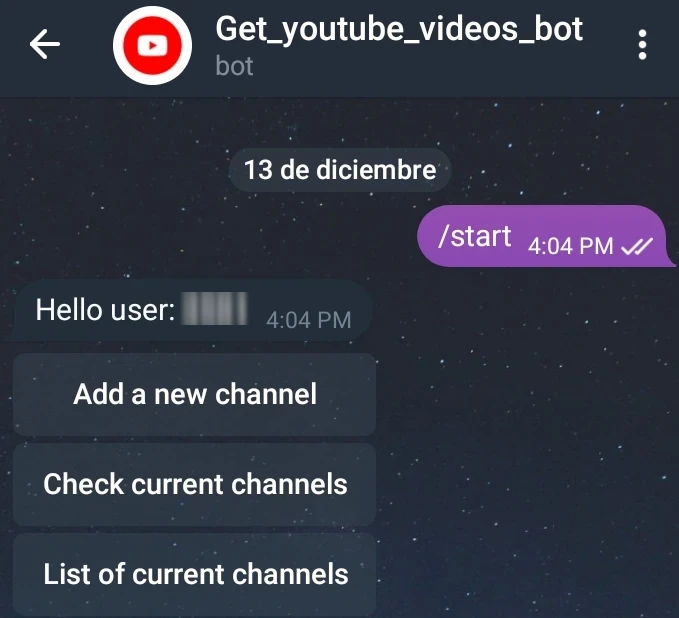
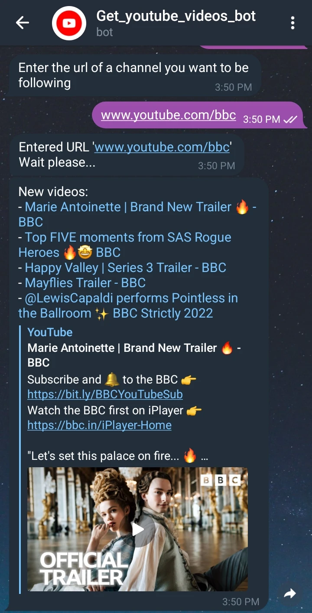
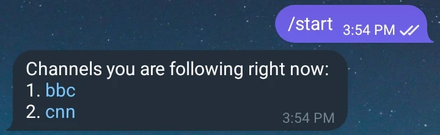
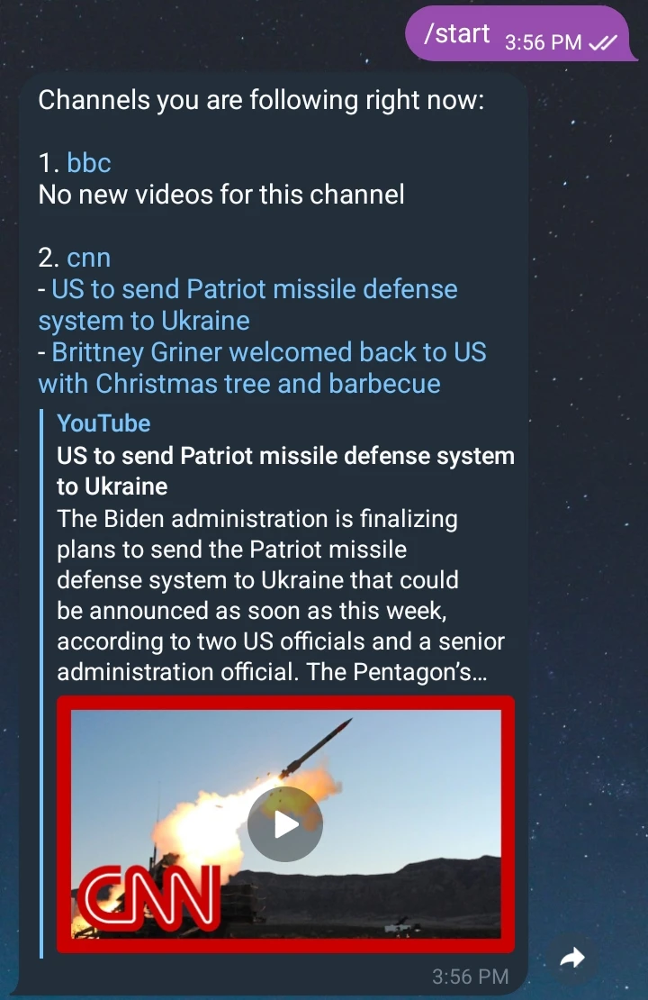

# Youtube Telegram bot Front

## Usage

- Get API Telegram key, see in [signing-in](https://docs.telethon.dev/en/stable/basic/signing-in.html).
- Write the credentials as environment variables in a `.env` file in "project" folder:
``` 
API_ID="..."
API_HASH="..."
BOT_TOKEN="..."
```
- Install python packages required using the dependency manager **Poetry**: `poetry install`.
- Finally, you just need to run this in the "project" folder `poetry run python bot.py`.

## Options example

### Main menu
To see the main menu press the "start" bottom or send a "/start" message.



### Add a new channel to follow

After selecting the first option "Add a new channel", the complete address of the channel is entered
for example "www.youtube.com/bbc".



###  Show all the channels we follow

Selecting the second option in the menu, we will see:
(In this case we are following two channels: BCC and CNN).



### Show the latest videos from all channels we are following

In this case, we have been seen all videos of BBC but there are 2 new videos from CNN.

